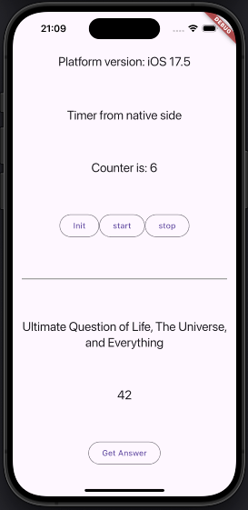

# Pigeon Timer Example

This is a simple example of how to use the pigeon plugin in Flutter.

## Getting Started

When you run this project, you'll see this interface:



The timer logic is written in Swift and Kotlin. The timer has a simple function to initialize, start, and stop the timer. When the timer is running, each second the native side transfers a new number to the Dart side and passes it into a stream.

## Motivation

🚀 The main goal of the project is to provide a simple and understandable example of how to use the pigeon plugin to transfer data to the native side and back.

✅ How to create [simple functions](#Implement-simple-function)  
✅ How to create [functions with return values](#Implement-function-with-return-value)  
✅ How to create [async functions with class parameters and return class values](#Implement-async-function-with-class-parameters-and-return-class-value)  
✅ How to [receive values from the native side and convert them into a stream](#Receiving-Values-from-Native-Side-and-Converting-Them-into-a-Stream)

# Examples

## Preparing

- Add the pigeon plugin to `dev_dependencies` in your `pubspec.yaml` file:

```yaml
dev_dependencies:
  pigeon: ^22.7.0
```

- run in terminal
```
dart pub get
```
- Create a ```pigeon/pigeon.dart``` file.
- Paste this code into the created ```pigeon.dart``` file and edit it based on your requirements:
```dart
import 'package:pigeon/pigeon.dart';

@ConfigurePigeon(PigeonOptions(
  dartOut: 'lib/pigeon.g.dart',
  dartOptions: DartOptions(),
  //edit this based on your main konlin file
  kotlinOut: 'android/src/main/kotlin/com/example/pigeon_timer/Pigeon.g.kt',
  //edit this based on your package name
  kotlinOptions: KotlinOptions(package: "com.example.pigeon_timer"),
  swiftOut: 'ios/Classes/Pigeon.g.swift',
  swiftOptions: SwiftOptions(),
  dartPackageName: 'com_example_pigeon_timer',
))

// Executing functions
@HostApi()
abstract class TimerHostApi {

}

// Receiving data from native. Stream-like
@FlutterApi()
abstract class TimerListenerApi {

}
```
- Run this command in your terminal (at the root of your project) to generate the Dart, Kotlin, and Swift code files
 ```
dart run pigeon --input pigeon/pigeon.dart
 ```
## Android
 - If you are going to edit Kotlin code, it is better to open the folder ```pigeon_timer/example/android``` in Android Studio to enable error highlighting and suggestion features in the IDE.
 - To set up the pigeon-generated file in Kotlin, open your implemented file. In our case, it is ```PigeonTimerPlugin.kt```. 

 ```kotlin
 package com.example.pigeon_timer

class PigeonTimerPlugin: FlutterPlugin, TimerHostApi {

  private var timerListenerApi: TimerListenerApi? = null

  override fun onAttachedToEngine(binding: FlutterPlugin.FlutterPluginBinding) {
    TimerHostApi.setUp(binding.binaryMessenger, this)
    timerListenerApi = TimerListenerApi(binding.binaryMessenger)
  }

  override fun onDetachedFromEngine(binding: FlutterPlugin.FlutterPluginBinding) {
    TimerHostApi.setUp(binding.binaryMessenger, null)
  }

}

 ```
 ## iOS
 - If you are going to edit Swift code, it is better to open the file ```pigeon_timer/example/ios/Runner.xcworkspace``` in Xcode to enable error highlighting and suggestion features in the IDE.
 - Set up the pigeon-generated file in Swift:

 ```swift
import Flutter

public class PigeonTimerPlugin: NSObject, FlutterPlugin, TimerHostApi {

    static var timerListenerApi : TimerListenerApi? = nil
    
    public static func register(with registrar: any FlutterPluginRegistrar) {
        let messenger : FlutterBinaryMessenger = registrar.messenger()
        let api : TimerHostApi & NSObjectProtocol & FlutterPlugin = PigeonTimerPlugin.init()
        TimerHostApiSetup.setUp(binaryMessenger: messenger, api: api)
        PigeonTimerPlugin.timerListenerApi = TimerListenerApi(binaryMessenger: messenger)
        registrar.addApplicationDelegate(api)
    }
  
}
 
 ```
<br>

# Adding new API examples

## Implement simple function

 - In the ```pigeon/pigeon.dart``` file, add a new function in the class marked as @HostApi
 ```dart
@HostApi()
abstract class TimerHostApi {
  void start();
}
 ```
 - Run this command in your terminal to update Dart, Kotlin, and Swift code files:
 ```
dart run pigeon --input pigeon/pigeon.dart
 ```

 - Add the new function to ```PigeonTimerPlugin.kt```:
```kotlin
class PigeonTimerPlugin: FlutterPlugin, TimerHostApi {
    
    private var timerListenerApi: TimerListenerApi? = null

    override fun onAttachedToEngine(binding: FlutterPlugin.FlutterPluginBinding) {
        ...
    }

    override fun onDetachedFromEngine(binding: FlutterPlugin.FlutterPluginBinding) {
        ...
  }

    // add this function 
    override fun start() {
        // add logging if needed
        Log.d("TAG","start function executed")
        // add implementation
        ...

    }
}
```

 - Add the new function to ```ios/Classes/PigeonTimerPlugin.swift```
```swift

public class PigeonTimerPlugin: NSObject, FlutterPlugin, TimerHostApi {

    static var timerListenerApi : TimerListenerApi? = nil
    
    public static func register(with registrar: any FlutterPluginRegistrar) {
        ...
    }
    
    // add this function 
    func start() throws {
        //add implementation
        ...
    }
}
```

## Implement function with return value
 - In the ```pigeon/pigeon.dart``` dd a new function in the class marked as @HostApi
 ```dart
@HostApi()
abstract class TimerHostApi {
  String getPlatformVersion();
}
 ```
 - Run this command in your terminal to update Dart, Kotlin, and Swift code files:
 ```
dart run pigeon --input pigeon/pigeon.dart
 ```

 - Add the new function to PigeonTimerPlugin.kt file
```kotlin
class PigeonTimerPlugin: FlutterPlugin, TimerHostApi {
  private var timerListenerApi: TimerListenerApi? = null

  override fun onAttachedToEngine(binding: FlutterPlugin.FlutterPluginBinding) {
    ...
  }

  override fun onDetachedFromEngine(binding: FlutterPlugin.FlutterPluginBinding) {
    ...
  }

  override fun getPlatformVersion(): String {
    return "Android " + Build.VERSION.RELEASE
  }
}
```

 - Add the new function to ```ios/Classes/PigeonTimerPlugin.swift```
```swift

public class PigeonTimerPlugin: NSObject, FlutterPlugin, TimerHostApi {
    
    static var timerListenerApi : TimerListenerApi? = nil
    
    public static func register(with registrar: any FlutterPluginRegistrar) {
        ...
    }
    
    // add this function 
    func getPlatformVersion() throws -> String {
        return "iOS " + UIDevice.current.systemVersion;
    }
}
```

## Implement Async Function with Class Parameters and Return Class Value
 - In the pigeon/pigeon.dart file, add a new function in the class marked as @HostApi
 ```dart
@HostApi()
abstract class TimerHostApi {
  @async
  Answer askImportantQuestion(Question question);

}

class Question {
  late String text;
}
class Answer {
  late String text;
}
 ```
 - Run this command in your terminal to update Dart, Kotlin, and Swift code files:
 ```
dart run pigeon --input pigeon/pigeon.dart
 ```

 - Add the new function to PigeonTimerPlugin.kt 
```kotlin
class PigeonTimerPlugin: FlutterPlugin, TimerHostApi {
    private var timerListenerApi: TimerListenerApi? = null

    override fun onAttachedToEngine(binding: FlutterPlugin.FlutterPluginBinding) {
        ...
    }

    override fun onDetachedFromEngine(binding: FlutterPlugin.FlutterPluginBinding) {
        ...
    }

    // add this function 
    override fun askImportantQuestion(question: Question, callback: (Result<Answer>) -> Unit) {
        
        //implementation
        [...]

        //send result back
        callback(Result.success(Answer("answerText")))

    }
}
```

 - Add the new function to  ```ios/Classes/PigeonTimerPlugin.swift```
```kotlin

public class PigeonTimerPlugin: NSObject, FlutterPlugin, TimerHostApi {
    
    static var timerListenerApi : TimerListenerApi? = nil
    
    public static func register(with registrar: any FlutterPluginRegistrar) {
        ...
    }
    
    // add this function 
    func askImportantQuestion(question: Question, completion: @escaping (Result<Answer, any Error>) -> Void) {
       //implementation
       [...]
       //send result back
       completion(Result.success(Answer(text: "answerText")));
    }
}
```

## Receiving Values from Native Side and Converting Them into a Stream
 - In the ```pigeon/pigeon.dart``` file, add a new function in the class marked as @FlutterApi and an initTimer function in the TimerHostApi  class for testing purposes
 ```dart
 @HostApi()
abstract class TimerHostApi {
  //method name "init" not allowed in swift. We use "initTimer" instead
  void initTimer();

}
@FlutterApi()
abstract class TimerListenerApi {
  void onTick(int? value);
}
 ```
 - Run this command in your terminal to update Dart, Kotlin, and Swift code files:
 ```
dart run pigeon --input pigeon/pigeon.dart
 ```

- I prefer to use the ```PublishSubject``` object from ```RxDart```  package, so we need to add it to ```pubspec.yaml```
```yaml
dependencies:
  # other dependencies
  rxdart: ^0.28.0
```
- Run this command in the terminal:
```
dart pub get
```
 - Create the file ```lib/pigeon_timer_listener.dart``` where we convert values into a stream:
 ```dart
import 'package:pigeon_timer/pigeon.g.dart';
import 'package:rxdart/rxdart.dart';

class PigeonTimerListener extends TimerListenerApi{
  PublishSubject<int> onTickSubject = PublishSubject();

  // This is important to make the onTick function work
  PigeonTimerListener() {
    TimerListenerApi.setUp(this);
  }

  @override
  void onTick(int? value) {
    if (value == null) return;
    onTickSubject.add(value);
  }
}
 ```

 - Add the new function to PigeonTimerPlugin.kt 
```kotlin
class PigeonTimerPlugin: FlutterPlugin, TimerHostApi {
    private var stopwatch : StopwatchTimer? = null;
    private var timerListenerApi: TimerListenerApi? = null

    override fun onAttachedToEngine(binding: FlutterPlugin.FlutterPluginBinding) {
        TimerHostApi.setUp(binding.binaryMessenger, this)
        // Initialization is necessary
        timerListenerApi = TimerListenerApi(binding.binaryMessenger)
    }

    override fun onDetachedFromEngine(binding: FlutterPlugin.FlutterPluginBinding) {
        TimerHostApi.setUp(binding.binaryMessenger, null)
    }

    // Add function and subscribe to getting values
      override fun initTimer() {
        // Sending back 3 values one after another
        timerListenerApi?.onTick(1) {}
        timerListenerApi?.onTick(2) {}
        timerListenerApi?.onTick(3) {}

        // Or subscribe to the event of a custom class
        stopwatch = StopwatchTimer()

        // Subscribe to the value change
        stopwatch?.onValueChanged = { newValue ->
            // Returning value
            timerListenerApi?.onTick(newValue.toLong()) {}
    }
  }
}
```

 - Add the new function to ```ios/Classes/PigeonTimerPlugin.swift```
```swift

public class PigeonTimerPlugin: NSObject, FlutterPlugin, TimerHostApi {
    
    var stopwatch : StopwatchTimer? = nil
    static var timerListenerApi : TimerListenerApi? = nil
    
     public static func register(with registrar: any FlutterPluginRegistrar) {
        let messenger : FlutterBinaryMessenger = registrar.messenger()
        let api : TimerHostApi & NSObjectProtocol & FlutterPlugin = PigeonTimerPlugin.init()
        TimerHostApiSetup.setUp(binaryMessenger: messenger, api: api)
        PigeonTimerPlugin.timerListenerApi = TimerListenerApi(binaryMessenger: messenger)
        registrar.addApplicationDelegate(api)
    }
    
    // add this function 
    func initTimer() throws {
        // sending back 3 values one after another
        PigeonTimerPlugin.timerListenerApi?.onTick(value: 1, completion: { _ in })
        PigeonTimerPlugin.timerListenerApi?.onTick(value: 2, completion: { _ in })
        PigeonTimerPlugin.timerListenerApi?.onTick(value: 3, completion: { _ in })

        // or subscribe to event of custom class
        stopwatch = StopwatchTimer()
        
        // Subscribe to the value change
        stopwatch!.onValueChanged = { newValue in
            print("Counter updated: \(newValue)")
            PigeonTimerPlugin.timerListenerApi?.onTick(value: Int64(newValue), completion: { _ in })
        }
    }
}
```